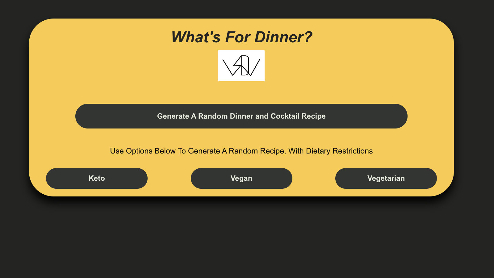
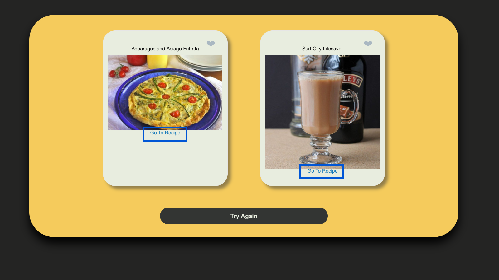
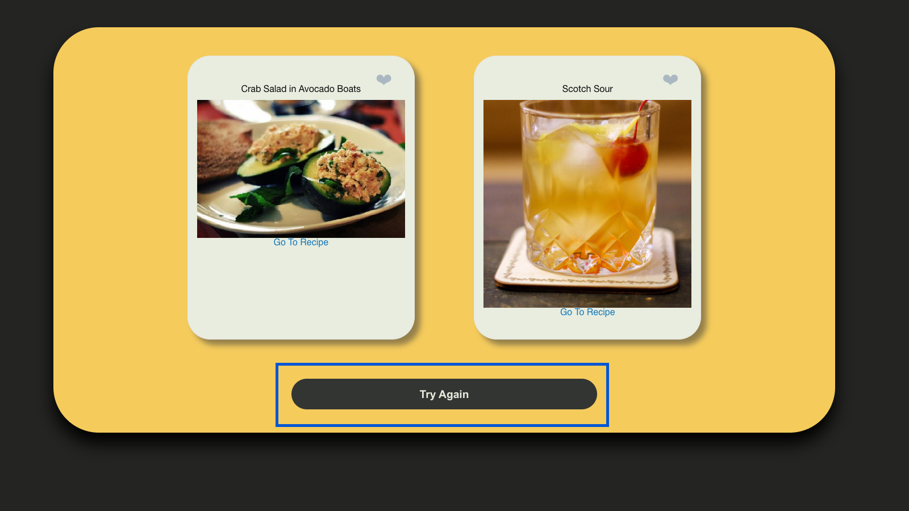

# What's 4 Dinner
## Github Deployment:
https://lindstdb.github.io/Whats-4-Dinner/

## Description:
This app was created to solve one simple, yet tedious problem.... "What's 4 Dinner ?".

Oh, I forgot to mention. DRINKS ON US!(well.....just the recipies)
## Screenshot:

## Functionality:

1. Upon loading the app you will be presented with the following image:

To generate your first dinner and drink combination, select the larger button in the center.

    You will also be given the option for Keto, Vegan, and Vegetarian options.

Once you select an option you will be taken to your first generated options.

2. You'll see two cards. One will present you an image of you food with a direct link to the recipe and the second will do the same, but for you paired cocktail!

3. At the bottom of this page you can also select 'Try Again'. This will take you back to our home page to regenerate recipe's.

## API's used:
- Spoonacular(https://spoonacular.com/food-api)
- CocktailDb(https://www.thecocktaildb.com/api.php)